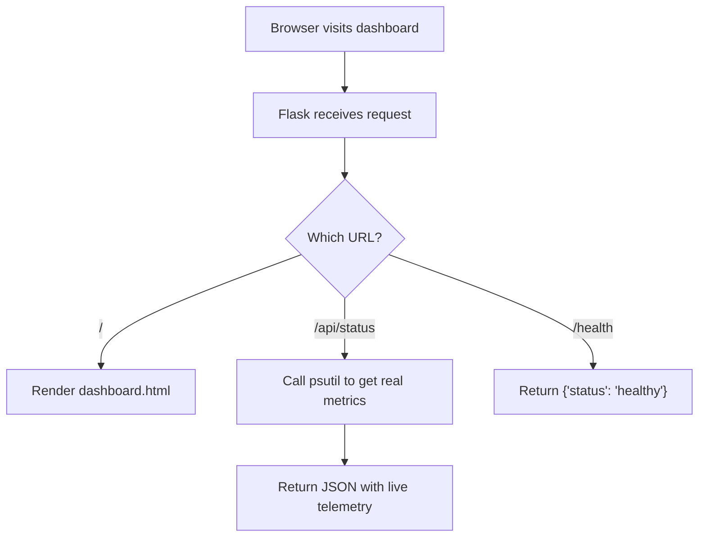
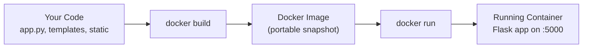
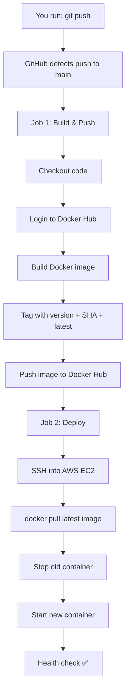
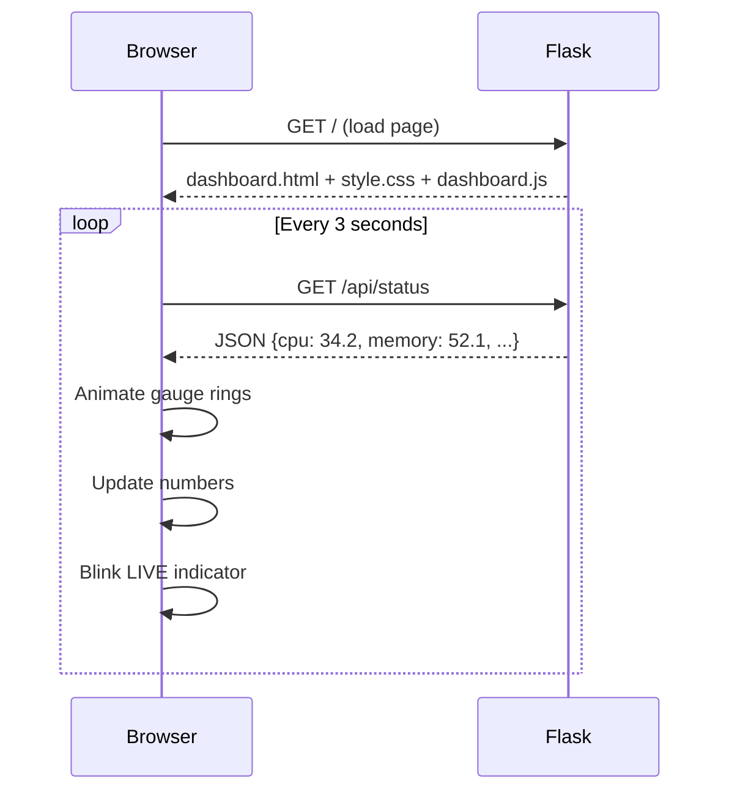
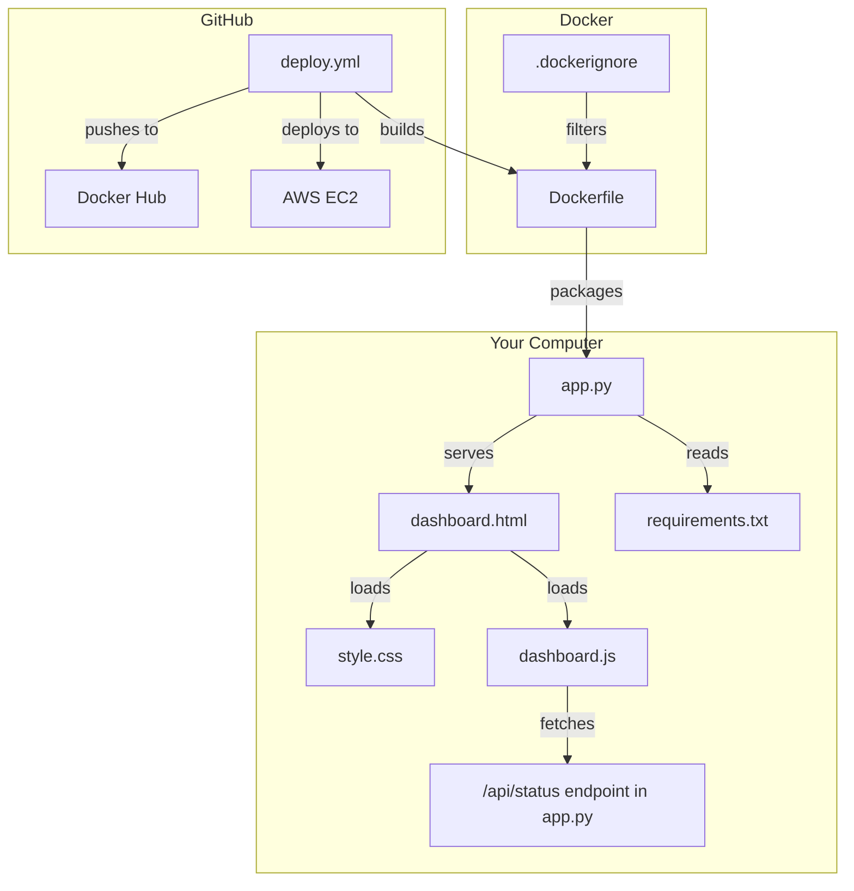

# 🚀 DevOps Status Dashboard — Full Project Explanation

---

## 1. What IS This Project?

This is a **real-time system monitoring dashboard** that shows the live health of a server — including CPU usage per core, memory distribution, disk I/O, network throughput, and the status of your CI/CD deployment pipeline.

Think of it like the **Control Center** for your infrastructure. It provides a visual, real-time window into how your server is performing and whether your latest code deployments were successful.

> [!IMPORTANT]
> This project uses **psutil**, a cross-platform library, to pull **actual system telemetry**. It is designed as a **flagship DevOps portfolio project**, demonstrating the full lifecycle from system-level monitoring to automated cloud deployment.

---

## 2. WHY Did We Build This?

This project demonstrates **5 core DevOps skills** in one project:

| Skill | What You're Proving |
|---|---|
| **Web Development** | You can build a Python Flask web app |
| **Containerization** | You can package apps with Docker |
| **CI/CD Automation** | You can set up automated build & deploy pipelines |
| **Cloud Deployment** | You can deploy to AWS EC2 |
| **Monitoring** | You understand what metrics matter and how to display them |

This is the kind of project you put on your **resume** or **GitHub profile** to show employers: *"I don't just write code — I know how to ship it to production."*

---

## 3. The Tech Stack — What Each Technology Does

### 🐍 Python (Flask) & psutil — "The Brain & Sensors"

**What is Flask?**
Flask is a lightweight Python web framework. It acts as the API server that collects data and serves it to the browser.

**What is psutil?**
`psutil` (process and system utilities) is a library for retrieving information on running processes and system utilization (CPU, memory, disks, network, sensors).

**What they do in our project:**
- **Real-time Monitoring:** `psutil` probes the operating system every few seconds to get actual CPU load, memory usage, and network traffic.
- **API Server:** Flask exposes these metrics via the `/api/status` endpoint.
- **Data History:** The backend maintains a rolling window of recent metrics to power the sparkline charts on the frontend.

**File:** [app.py](file:///c:/Projects/Devops-status-dashboard/app.py)



**Key code explained:**

```python
# Call psutil to get real CPU load
cpu_pct = psutil.cpu_percent(interval=0)

# Get detailed memory info
mem = psutil.virtual_memory()

# Return everything as a structured JSON object
return jsonify({
    "cpu": cpu_pct,
    "memory": mem.percent,
    "top_processes": _get_top_processes(),
    "system_info": _get_system_info(),
    "cpu_history": list(cpu_history), # For sparklines
    # ...
})
```

---

### 🐳 Docker — "The Shipping Container"

**What is Docker?**
Docker packages your app + all its dependencies into a **container** — a lightweight, portable box that runs the same way everywhere. No more "but it works on my machine!" problems.

**What it does in our project:**
- Takes our Flask app and wraps it into an **image** (like a snapshot)
- That image can run on any machine with Docker installed — your laptop, a CI server, AWS EC2 — identical behavior everywhere

**File:** [Dockerfile](file:///c:/Projects/Devops-status-dashboard/Dockerfile)

**How the Dockerfile works, line by line:**

```dockerfile
FROM python:3.11-slim          # Start with a small Linux + Python image
WORKDIR /app                   # Set working directory inside the container
COPY requirements.txt .        # Copy dependency list first (for caching)
RUN pip install -r requirements.txt  # Install Flask + Gunicorn
COPY . .                       # Copy all our app code
ENV APP_VERSION=1.0.0          # Set default environment variables
EXPOSE 5000                    # Tell Docker this app uses port 5000
HEALTHCHECK ...                # Auto-check if app is still alive
CMD ["gunicorn", ...]          # Start the production server
```



**Why Gunicorn instead of `python app.py`?**
- `python app.py` runs Flask's **development** server — single-threaded, not secure
- Gunicorn is a **production** WSGI server — handles multiple requests, more stable, what real companies use

---

### ⚙️ GitHub Actions — "The Automation Robot"

**What is GitHub Actions?**
It's a CI/CD service built into GitHub. When something happens in your repo (like a push), it automatically runs tasks you define — building, testing, deploying.

**What is CI/CD?**
- **CI (Continuous Integration):** Every code push is automatically built and tested
- **CD (Continuous Deployment):** Every successful build is automatically deployed to production

**What it does in our project:**

Every time you `git push` to the `main` branch, this pipeline runs automatically:



**File:** [deploy.yml](file:///c:/Projects/Devops-status-dashboard/.github/workflows/deploy.yml)

**Without GitHub Actions**, you'd have to manually:
1. Build the Docker image on your laptop
2. Push it to Docker Hub by hand
3. SSH into EC2 yourself
4. Pull the image and restart the container

**With GitHub Actions**, all of that happens automatically in ~2 minutes on every push. That's the power of CI/CD.

---

### ☁️ AWS EC2 — "The Cloud Server"

**What is EC2?**
Amazon EC2 (Elastic Compute Cloud) gives you a virtual server in the cloud. It's basically a computer running Linux in Amazon's data center that's accessible over the internet.

**What it does in our project:**
- Runs the Docker container in production
- Has a public IP address so anyone on the internet can access the dashboard
- GitHub Actions SSHs into it to deploy new versions

**What you'd need to set up:**
1. Create an EC2 instance (Ubuntu, `t2.micro` for free tier)
2. Install Docker on it: `sudo apt install docker.io`
3. Open port `5000` in the Security Group
4. Add the SSH key to GitHub Secrets

---

### 🖥️ Frontend (HTML + CSS + JS) — "The Face"

**What it does:**
The browser-side code that makes the dashboard look beautiful and update in real-time.



**3 files work together:**

| File | Role |
|---|---|
| [dashboard.html](file:///c:/Projects/Devops-status-dashboard/templates/dashboard.html) | Structure — gauge rings, metric cards, pipeline rows, architecture diagram |
| [style.css](file:///c:/Projects/Devops-status-dashboard/static/css/style.css) | Appearance — dark theme, glassmorphism, animations, responsive layout |
| [dashboard.js](file:///c:/Projects/Devops-status-dashboard/static/js/dashboard.js) | Behavior — polls API, animates SVG rings, **renders sparklines**, and updates the process table |

**New Flagship Features:**
- **Sparklines:** Real-time canvas-based charts showing the trend of your system metrics over time.
- **Per-Core View:** Visual breakdown of how every individual CPU core is being utilized.
- **Process Explorer:** Live-updating table of the most resource-intensive processes running on the host.
- **System Diagnostics:** Detailed panel showing OS version, architecture, and network throughput.

**How the gauge rings work:**
- Each gauge is an **SVG circle** with a `stroke-dashoffset` property
- When CPU is 0%, the dash offset = full circumference (circle is invisible)
- When CPU is 50%, the offset is halved (half-circle fills in)
- CSS `transition` makes it animate smoothly
- Color changes dynamically via JS: green (<50%), yellow (<75%), red (≥75%)

---

## 4. How Every File Connects



---

## 5. What To Do With This Project

### ✅ Right now (locally)
Your app is running at **http://localhost:5000**. Open it and watch the gauges move!

### 🚀 To deploy it for real

**Step 1 — Docker Hub:**
1. Create account at [hub.docker.com](https://hub.docker.com)
2. Create an access token in Settings → Security

**Step 2 — AWS EC2:**
1. Launch an Ubuntu `t2.micro` instance (free tier)
2. SSH in and install Docker: `sudo apt update && sudo apt install docker.io -y`
3. Open port 5000 in the Security Group

**Step 3 — GitHub Secrets:**
Go to your repo → Settings → Secrets → Actions → Add these:
- `DOCKERHUB_USERNAME` — your Docker Hub username
- `DOCKERHUB_TOKEN` — your access token
- `EC2_HOST` — your EC2 public IP (e.g. `54.123.45.67`)
- `EC2_USER` — `ubuntu`
- `EC2_SSH_KEY` — paste your private key (the `.pem` file contents)

**Step 4 — Push!**
```bash
git add .
git commit -m "feat: DevOps Status Dashboard"
git push origin main
```
GitHub Actions will automatically build, push, and deploy. 🎉

### 📝 For your resume/portfolio
> **DevOps Status Dashboard** — Built a real-time infrastructure monitoring dashboard using Flask, containerized with Docker, and deployed via a fully automated CI/CD pipeline (GitHub Actions → Docker Hub → AWS EC2). Features live-updating metrics, SVG gauge animations, and zero-downtime deployments.

---

## 6. Quick Command Reference

```bash
# Run locally with Python
python app.py

# Build Docker image
docker build -t devops-dashboard .

# Run Docker container
docker run -p 5000:5000 devops-dashboard

# Run with custom settings
docker run -p 5000:5000 \
  -e APP_VERSION=2.0.0 \
  -e ENVIRONMENT=production \
  devops-dashboard

# Check if app is healthy
curl http://localhost:5000/health

# Get raw metrics JSON
curl http://localhost:5000/api/status
```
